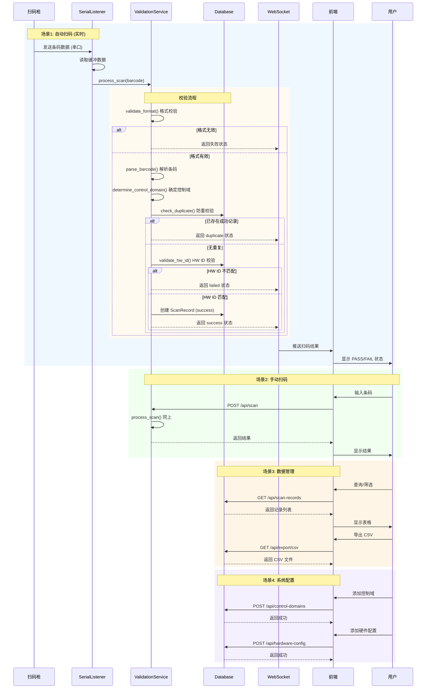
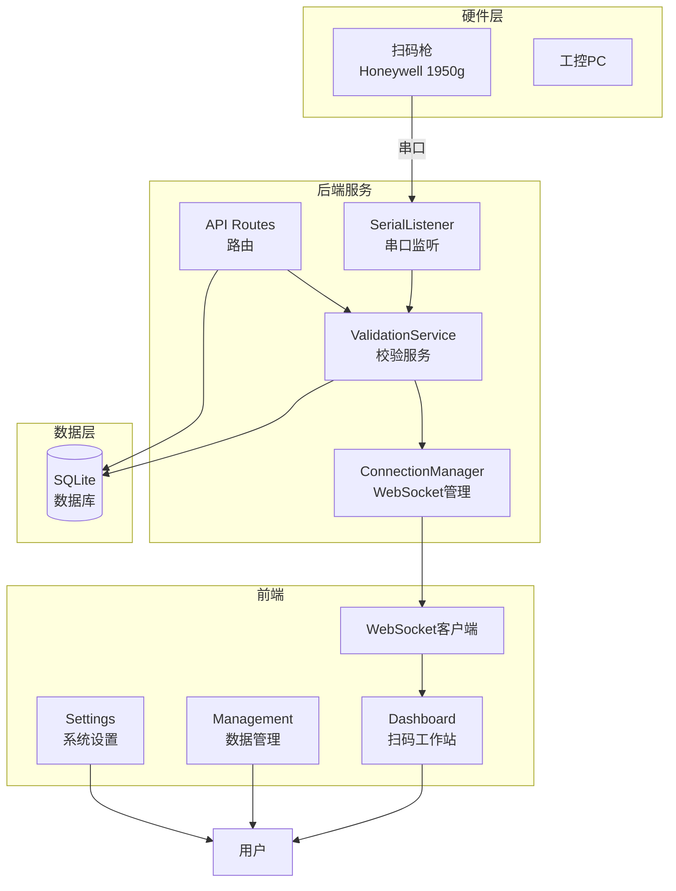
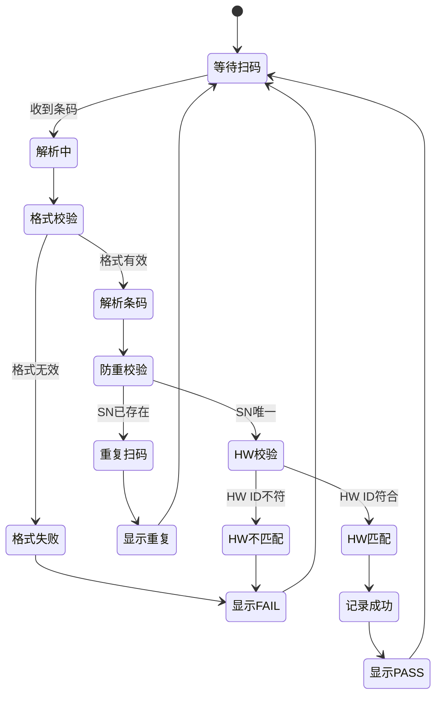

# ECU 扫码验证系统 - 业务流程泳道图

## 完整业务流程

## 核心模块交互

## API 端点汇总

| 模块 | 端点 | 方法 | 说明 |
|------|------|------|------|
| **健康检查** | `/` | GET | API 状态 |
| | `/api/health` | GET | 健康检查 |
| **扫码** | `/api/scan` | POST | 手动扫码 |
| | `/ws/scan` | WebSocket | 实时推送 |
| **串口** | `/api/serial/status` | GET | 获取串口状态 |
| | `/api/serial/connect` | POST | 连接串口 |
| | `/api/serial/disconnect` | POST | 断开串口 |
| **控制域** | `/api/control-domains` | GET | 获取控制域列表 |
| | `/api/control-domains` | POST | 创建控制域 |
| **硬件配置** | `/api/hardware-config` | GET | 获取硬件配置 |
| | `/api/hardware-config` | POST | 创建硬件配置 |
| **扫码记录** | `/api/scan-records` | GET | 获取扫码记录 |
| **刷写记录** | `/api/flash-records` | GET | 获取刷写记录 |
| | `/api/flash-records` | POST | 创建刷写记录 |
| **统计** | `/api/statistics/coverage` | GET | 获取覆盖率统计 |
| **导出** | `/api/export/csv` | GET | 导出CSV |

## 状态流转

## 数据库表结构

### scan_records (扫码流水表)
| 字段 | 类型 | 说明 |
|------|------|------|
| id | Integer | 主键 |
| barcode | String | 原始条码 |
| part_number | String | 零件号 |
| hardware_id | String | 硬件号 |
| serial_number | String | 序列号 |
| control_domain | String | 控制域 |
| status | String | 状态(pending/success/failed/duplicate) |
| error_message | String | 错误信息 |
| scanned_at | DateTime | 扫码时间 |

### flash_records (刷写状态表)
| 字段 | 类型 | 说明 |
|------|------|------|
| id | Integer | 主键 |
| serial_number | String | 序列号 |
| part_number | String | 零件号 |
| hardware_id | String | 硬件号 |
| control_domain | String | 控制域 |
| flash_status | String | 刷写状态 |
| flash_result | String | 刷写结果 |
| flashed_at | DateTime | 刷写时间 |

### control_domain_config (控制域配置)
| 字段 | 类型 | 说明 |
|------|------|------|
| id | Integer | 主键 |
| name | String | 名称 |
| domain_code | String | 代码 |
| description | String | 描述 |
| created_at | DateTime | 创建时间 |

### hardware_config (硬件配置)
| 字段 | 类型 | 说明 |
|------|------|------|
| id | Integer | 主键 |
| part_number | String | 零件号 |
| hardware_id | String | 硬件号 |
| control_domain | String | 控制域 |
| description | String | 描述 |
| is_active | Integer | 是否启用 |
| created_at | DateTime | 创建时间 |
