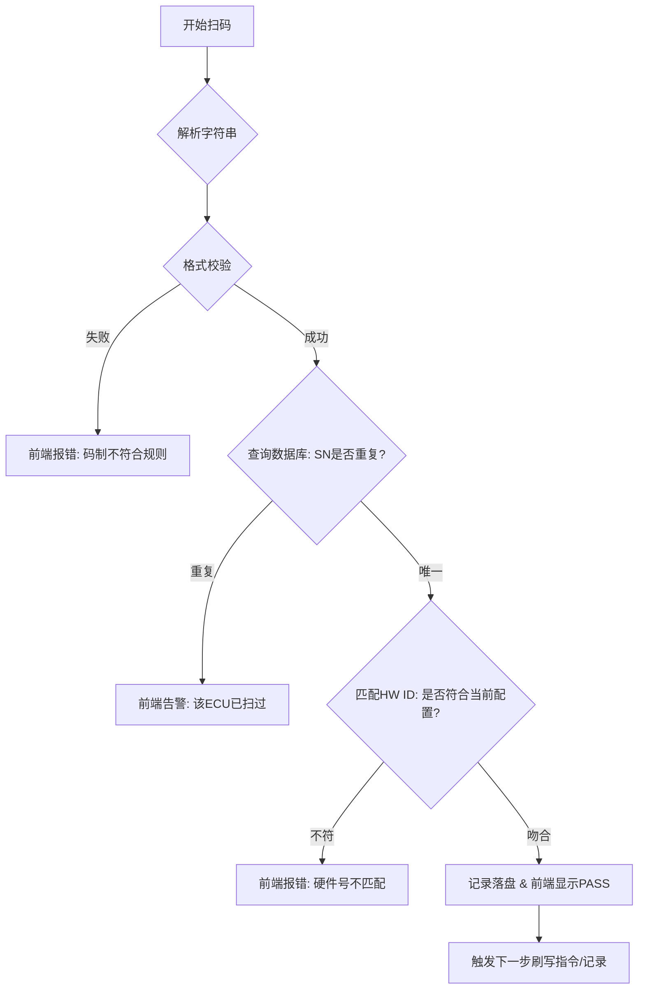

# ECU 扫码验证系统 - 产品需求文档

## 1. 项目背景与目标

### 1.1 背景

在车辆研发阶段，刷写台架（Flashing Bench）需对大量不同批次、不同控制域（Domain）的 ECU 进行固件刷写。目前依靠人工识别易导致：

- **硬件不匹配**：刷入不兼容的固件版本
- **重复刷写**：浪费工时且数据混乱
- **不可追溯**：后期出现缺陷无法精准定位是哪块硬件

### 1.2 目标

构建一套"端到端"的扫码验证系统，实现：

- **实时校验**：扫码即刻判断硬件号（HW ID）合规性
- **流程防错**：杜绝重复扫码，未校验通过禁止刷写
- **数字化管理**：建立 ECU 刷写记录数据库，支持多维度检索

---

## 2. 硬件需求方案

| 项目 | 规格 |
|------|------|
| **选型设备** | Honeywell 1950g（工业级二维影像式） |
| **接口模式** | USB Serial（虚拟串口模式） |

**核心理由**：

1. 能够解析汽车零件常用的 DPM（直接零件标识）码
2. 虚拟串口模式可实现后台静默监听，不干扰前端 UI 焦点

---

## 3. 功能需求拆解

### 3.1 后端引擎 (Backend Service)

#### [F01] 串口通讯监听 (Serial Listener)

**描述**：通过 pyserial 等库持续监听物理端口

**规则**：
- 支持波特率、数据位等参数配置
- 实现"心跳监测"，若扫码枪断开，前端需即时告警
- 数据清洗：去除条码前缀、后缀（如 `\r\n`）

#### [F02] 业务逻辑校验 (Validation Logic)

- **HW ID 校验**：比对当前扫码得到的零件号与后台配置的"目标硬件号"
- **防重校验**：检索数据库，若 SN 号已处于"成功"状态，触发报错提示
- **控制域分类**：根据条码特征（或预设规则）自动归类至动力域（PT）、底盘域（Chassis）等

#### [F03] 数据持久化 (CRUD API)

使用 SQLite 存储三类数据：
- **基础配置表**：控制域定义、合规 HW 列表
- **扫码流水表**：所有原始扫码记录
- **刷写状态表**：SN 与刷写结果的最终绑定关系

---

### 3.2 前端可视化 (Frontend Interface)

#### [V01] 扫码工作站 (Dashboard)

- **状态显示**：巨大的 PASS (绿) / FAIL (红) 状态反馈
- **核心信息**：扫码后即刻展示：控制域 | 硬件号 | 序列号 | 校验状态
- **快速切换**：支持手动选择当前刷写的"控制域"，以调整校验规则

#### [V02] 数据管理中心 (Management)

- **分类视图**：按控制域切换 Tab，查看各域下的 ECU 刷写覆盖率
- **模糊搜索**：
  - 输入 SN 或 PN 的任意片段即可实时过滤
  - 支持按时间区间筛选
- **数据导出**：一键导出 CSV 格式的刷写报告，用于研发存档

---

## 4. 业务流程图

---

## 5. 非功能性需求

| 需求类型 | 要求 |
|----------|------|
| **性能** | 扫码到前端显示状态延迟需 < 200ms |
| **容错性** | 若数据库写入失败，需有本地 Log 文件作为冗余备份 |
| **易用性** | 界面需适配 1080P 分辨率，关键信息大字体显示（适应台架操作距离） |

---

## 6. 项目评估（人日估算）

| 模块 | 人日 |
|------|------|
| 后端开发 (串口+API+逻辑) | 3 人日 |
| 前端开发 (看板+管理后台) | 4 人日 |
| 联调与测试 (硬件兼容性+异常链路) | 2 人日 |
| **总计预估** | **9 人日**（由 1 名全栈或 2 名分工工程师完成） |

---

## 7. PM 的 Insight（洞察）

> 既然你在做研发台架，我强烈建议在软件中增加一个 **"强制比对"模式**：即在开始刷写前的 1 秒钟，软件再次调取扫码记录进行自动比对。如果发现扫码记录与刷写包配置不一致，直接封禁 CAN 通讯。这能节省昂贵的硬件损坏成本。

---

## 附录：运行平台要求

| 配置项 | 规格 |
|--------|------|
| 处理器 | Intel i7 12700 或以上 |
| 内存 | 32GB |
| 存储 | 1TB × 2 固态硬盘（RAID 1） |
| 类型 | 工控行业主流品牌 |
